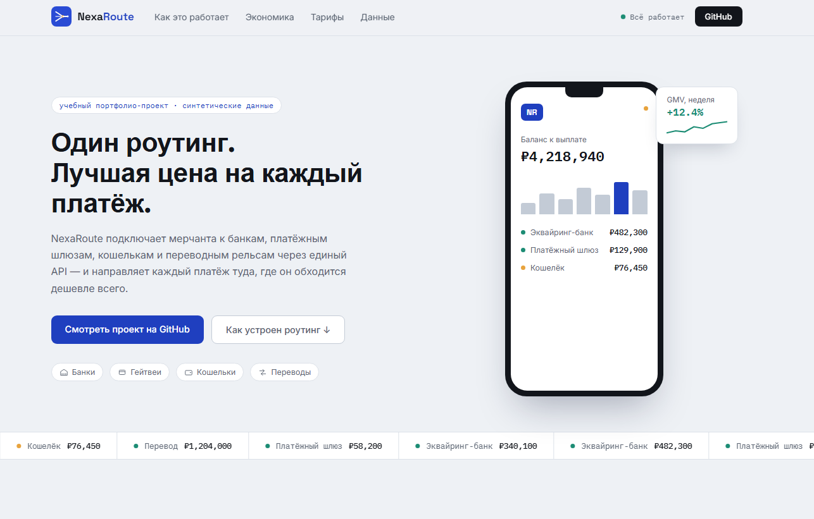
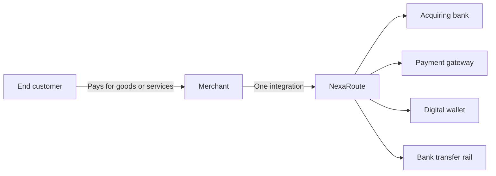
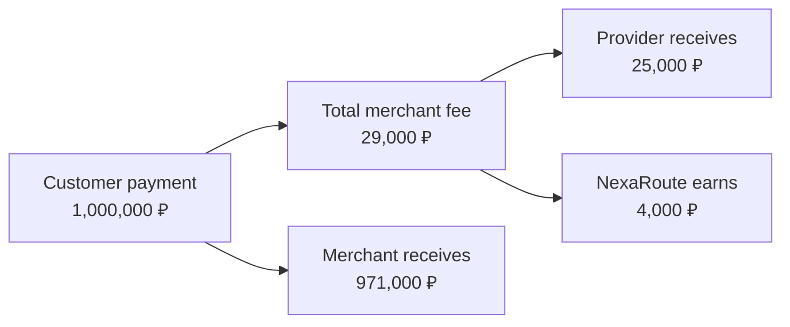
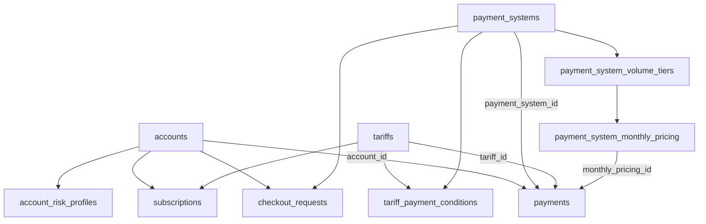

# NexaRoute — Payment Orchestration Analytics
> A portfolio analytics project that models the economics of a fictional B2B payment orchestration platform.

[](https://jaydenwhitehereboyz.github.io/saas-revenue-retention-analytics/)

[](https://jaydenwhitehereboyz.github.io/saas-revenue-retention-analytics/)


NexaRoute connects online businesses to multiple banks, payment gateways, wallets and transfer rails through one integration. The project focuses on the analytical core behind this business: payment volume, provider costs, transaction margin, subscription pricing, risk-based fees and customer behaviour.

All companies, provider names, rates and transactions are synthetic and created only for educational and portfolio purposes.

---

## Project value

This is not just a collection of SQL exercises. It is a business simulation designed to answer questions such as:

- What drives platform revenue: payment volume or margin?
- Which payment providers are most valuable?
- How do wholesale volume tiers affect unit economics?
- Which tariffs generate the strongest transaction economics?
- Which customers bring the most revenue and risk?
- When does a paid tariff become economically attractive for a merchant?
- How do changes in active merchants, payment frequency and average payment size affect GMV?

---

## Business model



NexaRoute gives merchants:

- one API instead of many provider integrations;
- access to multiple payment systems;
- lower processing costs through aggregated volume;
- payment routing and provider backup;
- unified reporting and reconciliation;
- payment analytics and commercial recommendations;
- recurring payments, refunds and operational support;
- advanced support, SLA and custom integrations on higher tariffs.

Payment providers receive aggregated traffic from many merchants. NexaRoute uses this combined volume to negotiate wholesale processing rates that may be unavailable to an individual merchant.

[Read the full business model](docs/business_model.md)

---

## How NexaRoute earns money

The platform has two main revenue streams:

```text
Platform revenue
= transaction margin
+ subscription revenue
```

### Example: one payment

A merchant processes **1,000,000 ₽**:



```text
Client-facing fee rate:  2.9%
Provider wholesale rate: 2.5%
Platform margin rate:     0.4%

Client fee amount:        29,000 ₽
Provider cost:            25,000 ₽
Platform revenue:          4,000 ₽
Merchant net amount:     971,000 ₽
```

The merchant compares the total offer with direct provider pricing. NexaRoute's internal revenue is the difference between the merchant fee and provider cost.

[Read the full revenue model](docs/revenue_model.md)

---

## Tariffs

| Tariff | Monthly price | Positioning |
|---|---:|---|
| Free | 0 ₽ | Public-like rates, basic dashboard and standard support |
| Pro | 20,000 ₽ | Lower rates, advanced analytics, recurring payments and priority support |
| Enterprise | 50,000 ₽ | Best rates, routing, SLA, account management and custom integrations |

Paid tariffs combine monthly subscription revenue with lower merchant processing rates.

---

## Dataset

The generator creates:

| Entity | Rows |
|---|---:|
| Business accounts | 5,000 |
| Payment systems | 8 |
| Provider volume tiers | 32 |
| Tariffs | 3 |
| Tariff/provider conditions | 24 |
| Subscription periods | 15,000 |
| Risk profiles | 5,000 |
| Payment attempts | 200,000 |
| Checkout requests | 1,000 |

Transactions cover **January 2022 through June 2026**.

---

## Data model



The central fact table is **payments**. It stores the merchant, provider, tariff, monthly wholesale pricing, processing rates and monetary split for each transaction.

Key equations:

```text
client_fee_amount
= payment_system_fee_amount + platform_fee_amount

merchant_net_amount
= amount - client_fee_amount

platform_margin_rate
= client_fee_rate - provider_cost_rate
```

---

## Pricing logic

### Client pricing

```text
effective client rate
= tariff/provider base rate
+ risk surcharge
```

### Provider pricing

The current synthetic model uses **whole-volume tiered pricing**. A provider's monthly wholesale rate depends on the total volume routed through that provider across all NexaRoute merchants.

The planned pricing-model improvement is **graduated pricing**, where each incremental volume band is charged at its own rate. This will reduce unrealistic margin cliffs near tier boundaries.

---

## Main analytical outputs

### KPI query packs

- [`06_payment_model_overview.sql`](sql/06_payment_model_overview.sql) — baseline economics and validation
- [`07_monthly_payment_kpis.sql`](sql/07_monthly_payment_kpis.sql) — monthly growth and payment dynamics
- [`08_payment_system_kpis.sql`](sql/08_payment_system_kpis.sql) — provider economics and volume tiers
- [`09_tariff_kpis.sql`](sql/09_tariff_kpis.sql) — tariff and tariff/provider economics
- [`10_risk_and_customer_kpis.sql`](sql/10_risk_and_customer_kpis.sql) — risk levels and customer value

### Business-analysis cases

- [September 2023 — revenue growth driven by margin expansion](analysis/case_01_2023_09_margin_expansion.md)
- [October 2022 — revenue growth driven by scale](analysis/case_02_2022_10_volume_led_growth.md)
- [April 2023 — stable GMV but revenue decline from margin compression](analysis/case_03_2023_04_margin_compression.md)

### Documentation

- [Business model](docs/business_model.md)
- [Revenue model](docs/revenue_model.md)
- [SQL metrics reference](docs/sql_metrics_reference.md)

---

## Core KPIs

```text
Gross Payment Volume
= SUM(amount)

Platform Transaction Revenue
= SUM(platform_fee_amount)

Weighted Client Fee Rate
= SUM(client_fee_amount) / SUM(amount)

Weighted Provider Cost Rate
= SUM(payment_system_fee_amount) / SUM(amount)

Weighted Platform Margin Rate
= SUM(platform_fee_amount) / SUM(amount)
```

The analytical hierarchy used throughout the project is:

```text
Platform revenue
├── Gross Payment Volume
│   ├── transacting accounts
│   ├── payments per account
│   └── average payment amount
└── platform margin
    ├── client fee rate
    └── provider cost rate
```

---

## Technology

- PostgreSQL
- SQL: CTEs, joins, window functions, aggregates and percentile calculations
- Python
- pandas
- NumPy
- synthetic-data generation
- Git and GitHub

---

## Repository structure

```text
database/          PostgreSQL schema and loading scripts
data_generation/   synthetic dataset generator
data/raw/           generated CSV files
sql/                analytical SQL queries
analysis/           concise business-analysis cases
docs/               business and metric documentation
```

---

## Run locally

Generate the dataset:

```bash
python data_generation/generate_data.py
```

Create the PostgreSQL schema:

```sql
\i 'database/01_create_tables.sql'
```

Load the generated CSV files:

```sql
\i 'database/02_load_data.sql'
```

Run an analytical query pack:

```sql
\i 'sql/07_monthly_payment_kpis.sql'
```

---

## Current scope and roadmap

Current scope:

- transaction economics;
- provider and tariff pricing;
- risk-based surcharge;
- monthly KPI decomposition;
- customer and segment analysis;
- business-case reporting.

Planned extensions:

- graduated provider pricing;
- subscription revenue and full platform P&L;
- actual chargebacks, disputes and fraud losses;
- retention and churn analytics;
- provider routing recommendations;
- Power BI dashboard.
