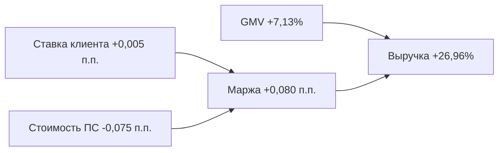

# Кейс 1. Сентябрь 2023: выручку разогнала маржа

## Вывод

В сентябре 2023 года транзакционная выручка платформы выросла на **26,96%**, хотя GMV увеличился только на **7,13%**. Главный драйвер — расширение маржи платформы с **0,434% до 0,515%**, то есть на **+0,080 п.п.**

## Иерархия показателей

| Уровень | Показатель | Август 2023 | Сентябрь 2023 | Изменение |
|---|---|---:|---:|---:|
| Результат | Выручка платформы | 17 579 554,88 ₽ | 22 318 248,81 ₽ | **+26,96%** |
| Драйвер 1 | GMV | 4 047 840 780,43 ₽ | 4 336 316 036,35 ₽ | **+7,13%** |
| Драйвер 2 | Маржа платформы | 0,434% | 0,515% | **+0,080 п.п.** |
| Поддрайвер | Активные бизнесы | 984 | 1 061 | +7,83% |
| Поддрайвер | Платежи на бизнес | 2,212 | 2,184 | -1,29% |
| Поддрайвер | Средний платёж | 1 859 366,92 ₽ | 1 871 521,81 ₽ | +0,65% |
| Цена | Ставка клиента | 3,132% | 3,137% | +0,005 п.п. |
| Себестоимость | Ставка ПС | 2,698% | 2,623% | **-0,075 п.п.** |

## Что именно сыграло

Ставка для клиента почти не изменилась, зато средняя закупочная ставка платёжных систем снизилась. Поэтому дополнительная маржа практически полностью осталась платформе.

В сентябре сразу несколько провайдеров перешли на более выгодный tier:

- **TBank:** Tier 2 → Tier 3, ставка ПС 4,7% → 4,4%;
- **SberPay:** Tier 2 → Tier 3, ставка ПС 2,2% → 2,1%;
- **YooKassa:** Tier 3 → Tier 4, ставка ПС 2,3% → 2,2%.

Это иллюстрирует главный экономический эффект агрегатора: общий трафик всех клиентов улучшает оптовые условия, даже если цена для отдельного бизнеса почти не меняется.

## Декомпозиция прироста выручки

Общий прирост выручки составил **4 738 693,93 ₽**:

- эффект роста GMV: **+1 252 829,89 ₽**;
- эффект расширения маржи: **+3 485 864,04 ₽**.

То есть около **74% прироста** обеспечила маржа, а не масштаб трафика.

## Бизнес-интерпретация

Месяц показывает, почему платформе недостаточно просто наращивать оборот. Переходы на лучшие volume tiers способны увеличить выручку намного быстрее GMV. Для управления такой экономикой нужно заранее отслеживать, каким провайдерам не хватает небольшого объёма до следующего tier, и при возможности направлять туда дополнительный трафик.