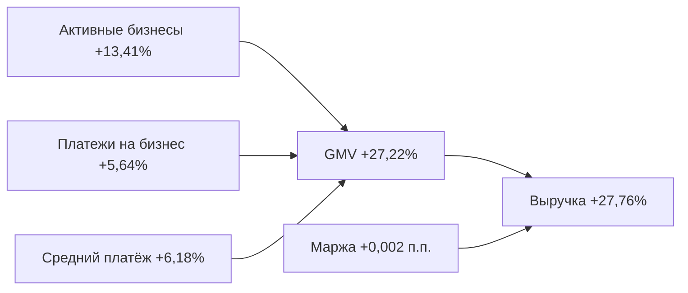

# Кейс 2. Октябрь 2022: классический рост за счёт масштаба

## Вывод

В октябре 2022 года транзакционная выручка платформы выросла на **27,76%**. Почти весь рост объясняется увеличением GMV на **27,22%**: маржа платформы практически не изменилась — **+0,002 п.п.**

## Иерархия показателей

| Уровень | Показатель | Сентябрь 2022 | Октябрь 2022 | Изменение |
|---|---|---:|---:|---:|
| Результат | Выручка платформы | 7 153 951,70 ₽ | 9 140 182,91 ₽ | **+27,76%** |
| Драйвер 1 | GMV | 1 843 808 552,90 ₽ | 2 345 610 424,35 ₽ | **+27,22%** |
| Драйвер 2 | Маржа платформы | 0,388% | 0,390% | +0,002 п.п. |
| Поддрайвер | Активные бизнесы | 425 | 482 | **+13,41%** |
| Поддрайвер | Платежи на бизнес | 2,198 | 2,322 | **+5,64%** |
| Поддрайвер | Средний платёж | 1 974 099,09 ₽ | 2 096 166,60 ₽ | **+6,18%** |
| Цена | Ставка клиента | 3,280% | 3,075% | -0,205 п.п. |
| Себестоимость | Ставка ПС | 2,892% | 2,685% | -0,206 п.п. |

## Что именно сыграло

Рост был широким и сбалансированным:

- стало больше активных бизнесов;
- каждый бизнес в среднем провёл больше платежей;
- средний размер платежа также увеличился.

При этом клиентская ставка и закупочная ставка ПС снизились почти одинаково. Поэтому платформа передала клиентам улучшение условий, но сохранила свою маржу практически неизменной.

## Декомпозиция прироста выручки

Общий прирост выручки составил **1 986 231,21 ₽**:

- эффект роста GMV: **+1 946 984,33 ₽**;
- эффект изменения маржи: **+39 246,88 ₽**.

Около **98% прироста** выручки обеспечил масштаб трафика.

## Бизнес-интерпретация

Это наиболее здоровый пример органического роста платформы: выручка растёт почти пропорционально обороту, а unit-экономика не ухудшается. Такой месяц не требует срочного вмешательства в pricing — важнее понять, устойчив ли рост клиентской базы и активности в следующих периодах.