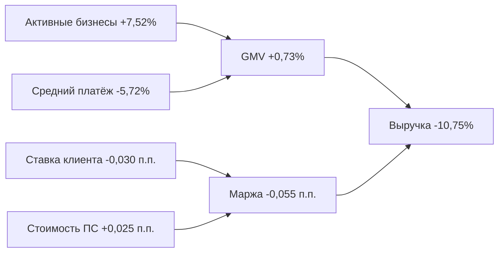

# Кейс 3. Апрель 2023: оборот удержался, но выручка упала

## Вывод

В апреле 2023 года GMV вырос на **0,73%**, а число активных бизнесов — на **7,52%**. Несмотря на это, транзакционная выручка платформы снизилась на **10,75%**. Причина — сжатие маржи с **0,482% до 0,427%**, или на **-0,055 п.п.**

## Иерархия показателей

| Уровень | Показатель | Март 2023 | Апрель 2023 | Изменение |
|---|---|---:|---:|---:|
| Результат | Выручка платформы | 16 878 458,72 ₽ | 15 064 005,03 ₽ | **-10,75%** |
| Драйвер 1 | GMV | 3 500 498 318,33 ₽ | 3 526 083 690,70 ₽ | +0,73% |
| Драйвер 2 | Маржа платформы | 0,482% | 0,427% | **-0,055 п.п.** |
| Поддрайвер | Активные бизнесы | 745 | 801 | **+7,52%** |
| Поддрайвер | Платежи на бизнес | 2,235 | 2,221 | -0,62% |
| Поддрайвер | Средний платёж | 2 102 401,39 ₽ | 1 982 059,41 ₽ | **-5,72%** |
| Цена | Ставка клиента | 3,216% | 3,186% | -0,030 п.п. |
| Себестоимость | Ставка ПС | 2,734% | 2,759% | **+0,025 п.п.** |

## Что именно сыграло

Платформа одновременно столкнулась с двумя неблагоприятными изменениями:

- средняя ставка для клиента немного снизилась;
- средняя закупочная ставка платёжных систем выросла.

Видимый операционный фактор — **TBank** опустился с Tier 3 на Tier 2, потому что месячный объём через него снизился примерно с **511,8 млн ₽ до 494,7 млн ₽**. Его ставка для платформы выросла с **4,4% до 4,7%**.

Получается, клиентская база продолжила расти, но новые объёмы не обеспечили достаточного GMV, а ухудшение закупочных условий съело выручку.

## Декомпозиция изменения выручки

Общее изменение выручки составило **-1 814 453,69 ₽**:

- эффект небольшого роста GMV: **+123 365,76 ₽**;
- эффект снижения маржи: **-1 937 819,45 ₽**.

Рост оборота частично компенсировал проблему, но не смог перекрыть падение маржи.

## Бизнес-интерпретация

Этот месяц показывает риск tiered pricing: провайдер может находиться совсем рядом с порогом следующего уровня, и небольшое снижение трафика резко повышает себестоимость. Для управления такой ситуацией полезно заранее выявлять провайдеров около границы tier и оценивать, можно ли перераспределить часть платежей, чтобы сохранить выгодную ставку.