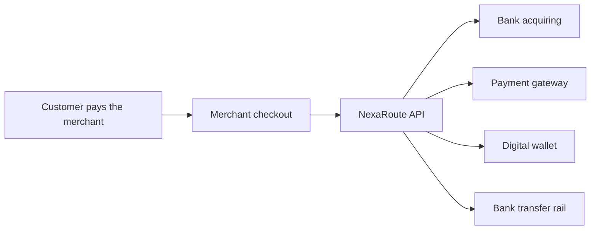

# NexaRoute: Business Model Overview

> **NexaRoute** is a fictional B2B payment orchestration platform created for this analytics portfolio project.

## What the company does

NexaRoute connects online businesses to multiple banks, payment gateways, wallets and transfer rails through one platform.



Instead of integrating and maintaining every payment provider separately, a business connects once to NexaRoute and manages payment operations from one place.

## Who the partners are

NexaRoute works with:

- acquiring banks;
- payment gateways;
- digital wallets;
- international payment providers;
- bank-transfer and instant-payment rails.

Payment providers receive aggregated transaction volume from many merchants. NexaRoute uses that combined volume to negotiate better wholesale processing terms than many individual merchants could obtain directly.

## Why businesses use NexaRoute

### One integration

A merchant works with one API instead of maintaining different provider APIs, credentials, webhooks, reporting formats and support channels.

### Lower processing costs

NexaRoute aggregates payment volume across all merchants and can receive lower provider rates. Part of that advantage is passed to merchants through lower client-facing fees.

### Multiple payment systems

Businesses gain access to several providers without negotiating and integrating with each one independently.

### Higher payment resilience

Payments can be routed to another provider when the primary provider is unavailable or performs poorly.

### Payment analytics and guidance

The platform combines provider data into one analytical layer and can recommend:

- a more cost-efficient provider;
- a more suitable tariff;
- routing changes;
- actions to improve payment success rate;
- ways to reduce processing costs.

### Unified operations

Typical platform capabilities include:

- consolidated payment reporting;
- refunds and payment-status tracking;
- recurring payments and saved payment methods;
- reconciliation across providers;
- provider activation requests;
- role-based access;
- priority support and SLA for larger clients;
- risk monitoring and pricing adjustments.

## Customer value proposition

```text
One integration
+ multiple providers
+ lower processing rates
+ unified analytics
+ operational support
+ payment resilience
= simpler and more efficient payment infrastructure
```

## Scope of the portfolio model

The project uses synthetic merchants, payment systems, tariffs, subscriptions, risk profiles and transactions. Provider names and rates are illustrative and do not represent real commercial offers.
