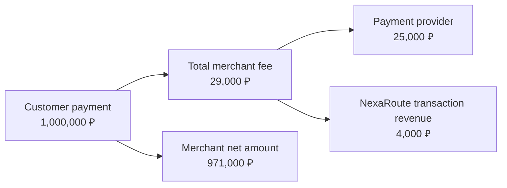

# NexaRoute: Revenue Model

## How NexaRoute earns money

NexaRoute has two revenue streams:

1. **Transaction margin** — the difference between the client-facing fee and the provider wholesale cost.
2. **Subscription revenue** — the monthly price of the selected platform tariff.

```text
Platform revenue
= transaction margin
+ subscription revenue
```

## Transaction economics in one payment

Assume a merchant processes a payment of **1,000,000 ₽**.

- client-facing processing rate: **2.9%**;
- provider wholesale cost: **2.5%**;
- platform margin rate: **0.4%**.



### Calculation

```text
Client fee amount
= 1,000,000 × 2.9%
= 29,000 ₽

Provider cost
= 1,000,000 × 2.5%
= 25,000 ₽

Platform transaction revenue
= 29,000 - 25,000
= 4,000 ₽

Merchant net amount
= 1,000,000 - 29,000
= 971,000 ₽
```

The merchant only evaluates the total commercial offer: fee, reliability, payment methods, support and platform features. The internal split between NexaRoute and the provider is NexaRoute's unit economics.

## Why payment providers offer lower rates

An individual merchant may process 10–100 million ₽ per month. NexaRoute combines the volume of thousands of merchants and can direct a much larger total flow to one provider.

The provider receives:

- more transaction volume;
- lower merchant-acquisition costs;
- one technical integration;
- a long-term distribution partner.

In return, NexaRoute can negotiate lower wholesale processing rates.

## Subscription plans

| Tariff | Monthly price | Commercial role |
|---|---:|---|
| Free | 0 ₽ | Entry point, basic platform access and public-like processing rates |
| Pro | 20,000 ₽ | Lower rates, advanced analytics, recurring payments and priority support |
| Enterprise | 50,000 ₽ | Best rates, routing, SLA, account management and custom integrations |

A paid tariff makes sense when the merchant's processing savings and operational benefits exceed the monthly subscription price.

Example:

```text
Direct processing rate: 3.0%
Pro rate:              2.7%
Monthly subscription:  20,000 ₽

Break-even GMV
= 20,000 / (3.0% - 2.7%)
≈ 6,666,667 ₽ per month
```

Above this monthly GMV, the fee saving alone can cover the Pro subscription.

## Risk-based pricing

The effective client rate can include a risk surcharge:

```text
effective client fee rate
= tariff/provider base rate
+ risk surcharge rate
```

The surcharge compensates the platform for expected dispute losses, chargeback exposure, monitoring, reserves and additional operational work.

It increases gross transaction revenue, but it should not be treated as pure profit until actual risk losses are deducted.

## Volume pricing

The current synthetic dataset implements **whole-volume tiered pricing**: the provider rate for a month is selected from the tier reached by total platform volume through that provider.

```text
Tier 1: below 100m ₽
Tier 2: 100m–500m ₽
Tier 3: 500m–1bn ₽
Tier 4: 1bn ₽ and above
```

A more stable future version can use **graduated pricing**:

```text
first volume band      → Tier 1 rate
next volume band       → Tier 2 rate
volume above threshold → Tier 3 or Tier 4 rate
```

Under graduated pricing, crossing a threshold changes the rate only for the incremental volume. This reduces sharp margin jumps near tier boundaries.

## Core economic metrics

```text
Gross payment volume
= SUM(amount)

Total client fees
= SUM(client_fee_amount)

Provider cost
= SUM(payment_system_fee_amount)

Platform transaction revenue
= SUM(platform_fee_amount)

Weighted platform margin rate
= SUM(platform_fee_amount) / SUM(amount)

Total platform revenue
= transaction revenue + subscription revenue
```

## Important limitation

`platform_transaction_revenue` is gross transaction revenue, not net profit. A full profitability model would also subtract:

- chargeback and fraud losses;
- dispute fees;
- infrastructure costs;
- support and operations;
- sales and account-management costs;
- taxes and other overhead.
